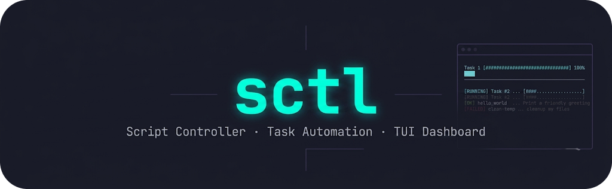
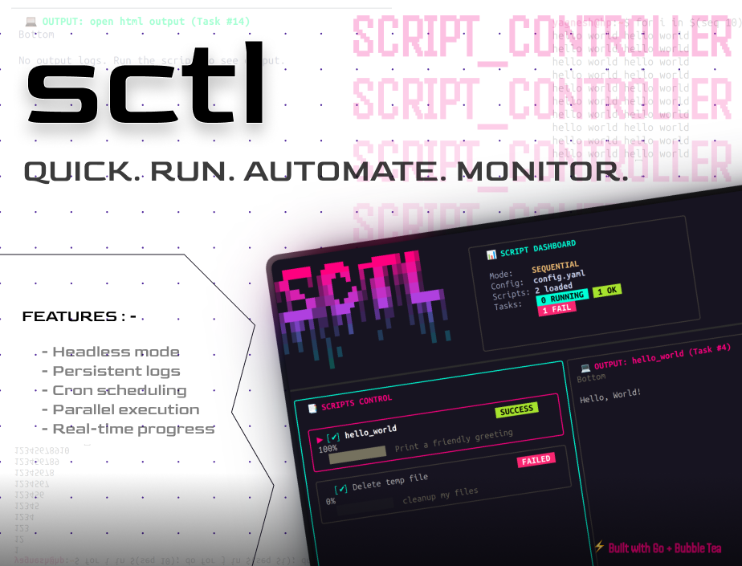

# sctl (Script Controller) 🚀

`sctl` is a modern, elegant Terminal User Interface (TUI) task automation dashboard, script runner, and cron scheduler built in Go using the **Bubble Tea** framework. It provides a visual workspace for managing, running, and scheduling tasks, scripts, and notebooks with real-time log monitoring and progress tracking.



---

## Features ✨

- **Interactive TUI**: Built with Bubble Tea & Lipgloss, featuring full viewport scrolling for logs, beautiful status badges, and real-time execution progress bars.
- **Dual-Mode Execution**:
  - **TUI Dashboard**: Trigger tasks manually, configure parameters, delete scripts, or stop processes interactively.
  - **Headless Mode**: Execute scripts directly via CLI command line (e.g. `sctl --run <alias>`) with live output streaming to stdout, perfect for background automation.
- **Automated Crontab Sync**: Assign a cron schedule to any task, and `sctl` will automatically synchronize it with your user `crontab` to run headlessly.
- **Cross-Platform Process Management**: Cleanly starts and terminates process trees. Uses Unix process groups on macOS/Linux and `taskkill` on Windows to guarantee child processes are cleaned up upon cancellation.
- **Persistent Log Files**: Saves task results, execution statuses, and incremental log streams to structured `task_<id>.yaml` files in your configured output directories.
- **Open HTML Output**: Automatically detects and opens the most recently generated HTML report or notebook output of a script in your default system browser (cross-platform).

---

## Installation 📦

### 1. Fast Installer (Recommended)
Install `sctl` to `/usr/local/bin` (or `~/.local/bin` if `/usr/local/bin` is not writable) with a single command:

```bash
curl -fsSL https://raw.githubusercontent.com/CodeWithYagnesh/sctl/refs/heads/main/install.sh | sh
```

### 2. Install via Go
If you have Go installed on your system, you can build and install the binary directly:

```bash
go install github.com/CodeWithYagnesh/sctl@latest
```

### 3. Uninstall
To completely remove `sctl` from your system (including its cron configurations):

```bash
# Remove the binary from possible installation directories
rm -f /usr/local/bin/sctl ~/.local/bin/sctl $(go env GOPATH)/bin/sctl 2>/dev/null || sudo rm -f /usr/local/bin/sctl

# Clean up any sctl scheduled jobs from your crontab
crontab -l 2>/dev/null | grep -v -E "SCTL" | crontab -
```

---

## Configuration ⚙️

`sctl` is configured via a simple `config.yaml` file. By default, it looks for `config.yaml` in the current directory, but you can override this path by setting the `SCTL_CONFIG` environment variable:

```bash
export SCTL_CONFIG="$HOME/.config/sctl/config.yaml"
```

### Example `config.yaml`

```yaml
scripts:
  - name_alias: system_check
    description: Run automated system health checks
    command: ./scripts/health_check.sh
    output_folder_path: ./output/system_check
    cron: "0 0 * * *" # Runs daily at midnight

  - name_alias: database_backup
    description: Production database backup script
    command: ./scripts/backup.sh
    output_folder_path: ./output/backup
    input:
      DB_NAME: "production"
      COMPRESSION_LEVEL: "9"
```

### Configuration Fields

| Field | Type | Description |
|---|---|---|
| `name_alias` | String | A unique, friendly identifier for your script/task. |
| `description` | String | A brief description of what the script does. |
| `command` | String | The shell command to run. |
| `output_folder_path` | String | Directory where run records (`task_<id>.yaml`) will be saved. |
| `input` | Map | Environment variables supplied to the script execution environment. |
| `cron` | String | *(Optional)* Standard cron expression to schedule automatic headless executions. |

---

## Usage 🛠️

### Launching the TUI Dashboard
Simply run `sctl` to launch the interactive interface:

```bash
sctl
```

#### TUI Keyboard Shortcuts ⌨️

| Key | Action |
|---|---|
| `k` / `↑` | Move selection up |
| `j` / `↓` | Move selection down |
| `Tab` | Switch focus between the script list (Left) and the log viewport (Right) |
| `Space` | Select / check script (for multi-selection execution) |
| `r` | Run the selected script (or all selected/checked scripts) |
| `s` | Force stop the running process |
| `a` | Create a new task configuration |
| `Enter` | Edit input environment variables for the selected script |
| `d` / `Delete` | Remove the selected task config |
| `p` | Toggle parallel execution mode (runs checked scripts concurrently or sequentially) |
| `o` | Open the latest HTML report/output file in the system default web browser |
| `[` / `]` | Scroll logs page up / page down |
| `q` / `Ctrl+C` | Quit `sctl` (terminating all active background tasks started in this session) |

### Running in Headless Mode
To run a script directly without opening the TUI dashboard (useful for cron jobs, scripts, or testing):

```bash
sctl --run <script-alias>
```

This runs the script, prints logs directly to stdout in real-time, and exits with a non-zero exit status if the script fails.

---

## Task Outputs & Logging 🗃️

Every run of a task is assigned an incremental `task_id` and saved in `output_folder_path` as `task_<id>.yaml`. The task file captures the configuration state, execution progress, and exact logs:

```yaml
task:
  task_id: 15
  script_name_alias: system_check
  state: Success
  progress: 100
  logs: |
    [15:30:00] Starting automated system health checks...
    [15:30:04] Checked system metrics. All parameters normal.
    [15:30:05] Finished successfully.
```

---

## Script Progress Integration 📊

`sctl` supports real-time progress bar updates in the TUI dashboard. To update the progress bar from within your custom script, simply print a line to standard output (stdout) prefixed with `__PROGRESS__:` followed by an integer from `0` to `100`.

These progress lines are intercepted by `sctl` to update the UI and are automatically filtered out from your task logs.

### Python Example
```python
import time
import sys

print("Initializing system update...")
sys.stdout.flush()
time.sleep(1)

# Report 20% progress
print("__PROGRESS__:20")
sys.stdout.flush()

print("Downloading dependencies...")
time.sleep(2)

# Report 60% progress
print("__PROGRESS__:60")
sys.stdout.flush()

print("Applying changes...")
time.sleep(2)

# Report 100% progress
print("__PROGRESS__:100")
sys.stdout.flush()
```

### Bash Example
```bash
#!/bin/bash

echo "Starting deployment..."
sleep 1

echo "__PROGRESS__:10"
echo "Cleaning up temp files..."
sleep 1

echo "__PROGRESS__:50"
echo "Copying assets..."
sleep 2

echo "__PROGRESS__:90"
echo "Restarting services..."
sleep 1

echo "__PROGRESS__:100"
echo "Deployment successful!"
```

---

## Contributing 🤝

Contributions are welcome! Please open an issue or submit a pull request if you want to propose improvements or bug fixes.

## License 📄

This project is licensed under the MIT License.
